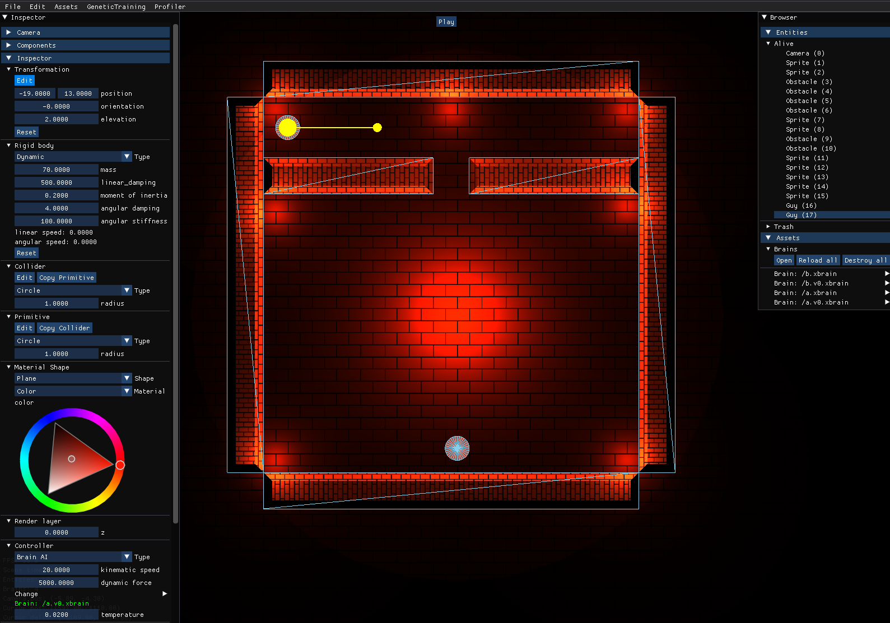

# CROSSOVER
A little 2d sandbox to play with genetic AI training with several fancy features (dynamic light, pseudo 3d materials, game engine-like editor)




## Quick Start
Build with cmake

```bash
mkdir build && cd build && cmake .. && make
```

Run
```bash
./bin/crossover
```

I've tried to add some cross-platform support and part of the codebase has been adopted for it.
Though, I didn't try to build it in any environment but Ubuntu 20.04.6 LTS
